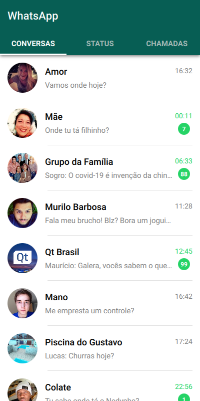

# My QML Recreations Showcase

## Nubank


### :grey_question: About

Nubank is a digital bank that is redesigning the credit card
experience with an efficient and transparent mobile-first approach.

### :star: Highlights

• Home screen
<br/>
• Card animation (swipe down to show menu)
<br/>
• Menu
<br/>
• Sliding tab buttons

### :computer: Running

```
$ qmlscene nubank/main.qml
```

<br/>

## WhatsApp



### :grey_question: About

WhatsApp is a cross-platform messaging and VoIP service. It allows users
to send text messages and voice messages, make voice and video calls,
and share images, documents, user locations, and other media.

### :star: Highlights

• Header with dropshadow effect
<br/>
• Mobile-friendly tab navigation (swiping sideways with animation)
<br/>
• Rounded user picture using pure QML (opacity mask)
<br/>
• Animated message list

### :computer: Running

```
$ qmlscene whatsapp/main.qml
```
